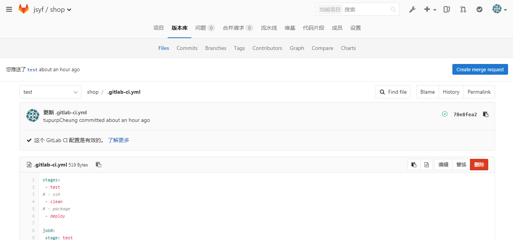

### 0：写在前面    
0：[官方参考](https://docs.gitlab.com.cn/runner/ "https://docs.gitlab.com.cn/runner/") 

1：GitLab的自动化部署时需要结合GitLab-Runner来使用的。        

2：自`GitLab 8.0`之后，GitLab已经默认集成了CI，所以我们只需要安装配置GitLab-Runner就可以完成相应的自动化部署。    

3：尽管GitLab-Runner可以与GitLab安装在同一服务器，但还是不推荐这样做，尽量安装在不同的服务器上。   

4：GitLab-Runner 可以在GNU/Linux, macOS, FreeBSD 和 Windows 上安装使用。 这里有三种安装方式 使用 Docker， 手动下载二进制文件，或使用 GitLab 提供的 rpm/deb 仓库进行[安装](https://docs.gitlab.com.cn/runner/install/ "https://docs.gitlab.com.cn/runner/install/")。    

5：GitLab Runner 实现了许多可用于在不同场景中运行您的 build (构建)的 executors (执行器)，这里使用的是最简单的shell。      

6：对于不同语言写成的代码，如Java,PHP，包括Vue等，其需要的解释环境，或者编译环境；运行环境其要求是不同的，这就要求我们在GitLab-Runner的安装服务器上安装对应的（解释）编译，运行环境。比如运行java的spring框架代码，一般就要求有jdk,maven,tomcat(或其他容器)环境，对于Vue的前端代码，则需要node.js环境来运行。

### 1：安装GitLab-Runner

> #### 1.1：[windows环境](https://docs.gitlab.com.cn/runner/install/windows.html "https://docs.gitlab.com.cn/runner/install/windows.html")安装GitLab-Runner        

>> ##### 1.1.1：在系统某个盘符或者文件目录下新建一个文件夹 GitLab-Runner       

>> ##### 1.1.2：下载符合你系统位数的安装包[x64](https://gitlab-runner-downloads.s3.amazonaws.com/latest/binaries/gitlab-runner-windows-386.exe "https://gitlab-runner-downloads.s3.amazonaws.com/latest/binaries/gitlab-runner-windows-386.exe")或者[x86](https://gitlab-runner-downloads.s3.amazonaws.com/latest/binaries/gitlab-runner-windows-386.exe "https://gitlab-runner-downloads.s3.amazonaws.com/latest/binaries/gitlab-runner-windows-386.exe")到你方才创建的文件夹中并将安装包重命名为`gitlab-runer.exe`。     

>> ##### 1.1.3：以管理员身份运行方才下载的.exe文件即可  
> #### 1.2：[GNU/Linux环境](https://docs.gitlab.com.cn/runner/install/linux-repository.html "https://docs.gitlab.com.cn/runner/install/linux-repository.html")安装GitLab-Runner(Centos)      

>> ##### 1.2.1：添加GitLab-Runner官方仓库     

    curl -L https://packages.gitlab.com/install/repositories/runner/gitlab-runner/script.rpm.sh | sudo bash   
    
>> ##### 1.2.2：安装最新版本的GitLab-Runner

    sudo yum install gitlab-runner
    
或者是安装指定版本的GitLab-Runner

    yum list gitlab-runner --showduplicates | sort -r
    sudo yum install gitlab-runner-$version     
    
安装成功后，默认会新建gitlab-runner的用户和组，即/home/gitlab-runner  

### 2：注册GitLab-Runner与各命令选项含义[官方教程](https://docs.gitlab.com.cn/runner/register/index.html "https://docs.gitlab.com.cn/runner/register/index.html")

> #### 2.1：注册GitLab-Runner    

    sudo gitlab-runner register

> #### 2.2：各命令选项含义    

>> ##### 2.2.1:输入GitLab实例URL

    Please enter the gitlab-ci coordinator URL (e.g. https://gitlab.com )
   
 此处如果是注册GitLab的共享runner，则该URL可GitLab的管理区域找到     
             

而如果是某个项目特定的runner，可在某个项目中找到
 
 
 >> ##### 2.2.2：输入用于注册runner的token
 
        Please enter the gitlab-ci token for this runner
 
 共享的token和特定的token可以在上面的两张图中找到
 
 >> ##### 2.2.3：输入该 Runner 的描述，稍后也可通过 GitLab's UI 修改
 
        Please enter the gitlab-ci description for this runner
        
  其实无关紧要，自己能看懂就可以
  
 >> ##### 2.2.4：给该 Runner 指派 tags, 稍后也可以在 GitLab's UI 修改
 
        Please enter the gitlab-ci tags for this runner (comma separated):
        
  此处输入的自定义的tag名称是与 下一个 选项 值 有关系的，在此处输入tag名称，多个tag使用逗号隔开。            
  当 2.2.5 设置值为false时，意味着该runner只会执行.yml文件中设置了tags且值为此处设置的tag名称的任务。              
  如果2.2.5设置值为true，则此runner一定会执行.yml文件中设置的任务
  
 >> ##### 2.2.5：选择 Runner 是否可以接收未指定 tags 的任务（默认值：false）， 稍后可以在 GitLab's UI 修改
  
        Whether to run untagged jobs [true/false]:
        
 >> ##### 2.2.6：选择是否为当前项目锁定该 Runner， 之后也可以在 GitLab's UI 修改。 该功能通常用于被指定为某个项目的 Runner （默认值：true）
  
        Whether to lock Runner to current project [true/false]:
        
   若值为true，即锁定，则该项目必定使用此runner执行任务
   
 >> ##### 2.2.7：选择 Runner executor
  
        Please enter the executor: ssh, docker+machine, docker-ssh+machine, kubernetes, docker, parallels, virtualbox, docker-ssh, shell:
        
   建议选择shell

> #### 2.2：gitlab-runner的[高级配置](https://docs.gitlab.com/runner/configuration/advanced-configuration.html) 
 在成功注册一个runner后，一般而言，我们会在`/etc/gitlab-runner/config.toml`这个路径下看到runner的配置文件，此时配置文件中的
 内容如下：
         
          concurrent = 1     //全局设置，含义为gitlab-runner最多同时可以执行多少个任务，0不代表无限。
          check_interval = 0 //全局设置，含义为作业检查之间的间隔长度

         [[runners]]  //具体的runner设置
           name = "描述"
           url = "http://xx.xx.xx.xx:xxx/"
           token = "04824328683dsfajion12456"
           executor = "shell"
           [runners.cache]

    其中：[[runners]]下有一些比较重要的配置：
       <1>builds_dir：此选项表示runner执行工作时，代码的存放路径，如果不设置，默认为/home/gitlab-runner/builds/../..
    
 ### 3:GitLab的Runner UI
               
 
 点击上图的Runner令牌后，可以对runner进行重新配置
 
 ### 4:自动打包发布maven项目
 
 >> #### 4.1：一些注意点
 
 1：.gitlab-ci.yml中各个shell的执行环境（服务器）为gitlan-runner的服务器
 2：如果将mvn package放到一个任务中，将执行打包脚本放到另一个任务中，之前打包好的文件会被清除，造成无法自动发布到tomcat
 3：在runner运行中曾经遇到过 Cannot allocate memory 的错误（没法分配内存），我采取的解决办法是临时更改： echo 1 > /proc/sys/vm/overcommit_memory            
 
 >> #### 4.2：编写自动发布脚本文件
 
 如果是单纯的war包项目，只需要将打包好的war包扔到tomcat下即可（建议此tomcat安装文件夹的所有者为gitlab-runner，即使用gitlab-runner用户安装此 tomcat,或安装后更改文件夹所有者）               
 
因为我们的项目是个分布式的项目，所以还需要启动生产者，具体流程如下：          

1：新建一个路径，如：`/usr/.../.../sys-service `       

注意文件夹所有者也为gitlab-runner，否则执行复制操作的时候会没有权限            

2：将[jar包的自动启动脚本](../images/gitlab/sys-service.sh)复制到此（1）文件夹下，记得赋予执行权限          

3：停止(2)中的脚本，删除(1)路径下原有的生产者jar包和依赖lib包文件夹，在自动发布脚本文本中将相应的jar包和依赖Lib文件夹复制到此（2）路径下，然后启动 ② 中的脚本              

4：在[自动发布脚本](../images/gitlab/sys-service-deploy.sh)中先完成（1,2,3）的操作，然后将打包好的项目war包（消费者）复制到tomcat下即可（先删除旧的war包和其解压文件夹，如果tomcat没有热部署，应该先停止tomcat，在操作完成后启动tomcat）
 
 
 ### 4.3：编写.gitlab-ci.yml文件（点击项目的CI Settings）
 
          
 点击了解更多可以学习编写规则
 
 ### 4.4：简单的.gitlab-ci.yml示例
 
        stages:
         - test
        # - ssh
         - clean
        # - package
         - deploy

        job0:
         stage: test
         script:
          - echo "i am test test"
          - pwd
         tags:
          - test
         only:
          - test

        #job1:
        # stage: ssh
        # script:
        #  - ssh -t -t root@47.100.46.209 -p 22

        job2:
         stage: clean
         script:
         - cd jsyf-parent
         - mvn clean
         tags:
          - test
         only:
          - test

        #job3:
        # stage: package
        # script:

        job4:
         stage: deploy
         script:
          - cd /home/gitlab-runner/....
          - mvn package -P dev  #此处可以指定使用什么环境的配置文件进行打包（用什么环境打包就发布到对应的环境服务器）
          - cd ~
          - pwd
          - ifconfig
          - ./sys-service-deploy.sh
         tags:            #这个标记的作用是 指定哪一个runner执行此任务（也就是说可以打包到不同环境的服务器上）
          - test
         only:            #这个标记的作用是 指定哪个分支 的提交操作会触发此任务
          - test

 ### 5:Gitlab-runner 的常用命令
 
 >> #### 5.1：linux环境
 
输入如下命令,查看gitlab-runner的全部命令

        gitlab-runner --h            
        
        
显示如下：       
        NAME:
            gitlab-runner - a GitLab Runner
        
        USAGE:
           gitlab-runner [global options] command [command options] [arguments...]
           
        VERSION:
           9.5.1 (96b34cc)
           
        AUTHOR(S):
           GitLab Inc. <support@gitlab.com> 
           
        COMMANDS:
           exec                 execute a build locally
           list                 List all configured runners
           run                  run multi runner service
           register             register a new runner
           install              install service
           uninstall            uninstall service
           start                start service
           stop                 stop service
           restart              restart service
           status               get status of a service
           run-single           start single runner
           unregister           unregister specific runner
           verify               verify all registered runners
           artifacts-downloader download and extract build artifacts (internal)
           artifacts-uploader   create and upload build artifacts (internal)
           cache-archiver       create and upload cache artifacts (internal)
           cache-extractor      download and extract cache artifacts (internal)
           help, h              Shows a list of commands or help for one command
       
        GLOBAL OPTIONS:
           --debug              debug mode [$DEBUG]
           --log-level, -l      Log level (options: debug, info, warn, error, fatal, panic)
           --cpuprofile         write cpu profile to file [$CPU_PROFILE]
           --help, -h           show help
           --version, -v        print the version
   
   
 其中,register命令上文已经提及，start,stop,restat,status命令无需多提，这里需要提及的只有两命令，一个是list，一个是unregister          
 
        gitlab-runner list
        
   此命令的含义为列表展示当前的gitlab-runner所有的已注册的runner
   
        gitlab-runner unregister --url 注册时的url --token 注册时的token
        
        
   此命令含义为注销某个runnner， 其中--url 注册时的url 可以使用 --name 注册时的描述
